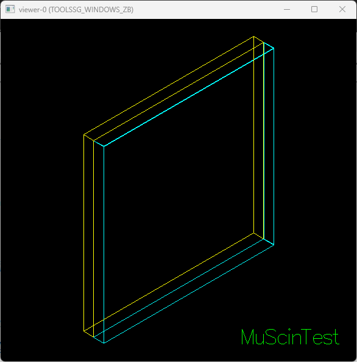
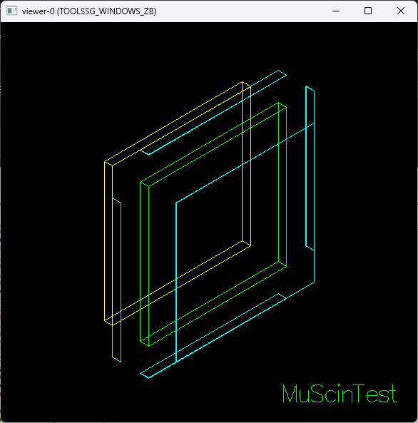



# Purposes
---
This Geant4 project is meant to verify the correct implementation of a Scintillator+SiPM detector working with mu- particles.

In particular, for a fixed set of parameters such as 
- the muons energy distribution,
- the spread of the muon beam at the target surface,
- geometry of the detector (thickness of layers),
- materials of the detector (scintillation + optical surface logic)

(primarily) i want to check that 
- the muons release their energy mostly inside the scintillator and not in other components.
- the visible light in the scintillator is detected by the SiPM with a good efficiency.
- the overall detector response is consistent with the theory/literature

# Dependencies
---
> **Geant4** (v11.3.0)

> **ROOT** (v6.32.10), to compile and run the RootApp

> **rapidyaml** (v0.10.0), to parse YAML configuration files
 
# Implementation
---
With that in mind i implemented a simple geometry configuration (following the same logic of the LabA3 experiment) that consists of:
- a scintillator plate
- a coating made of aluminum (exposing a single face of the plate)
- a SiPM (aligned to the exposed face of the plate)

(Note: for simplicity there won't be any optical grease between the plate and the SiPM)

This is the workflow i usually follow when working in Geant4:
1. program geometry, materials, optical properties and primary generator actions, check that everything works as expected.
2. program SDs, MVD, run / event / tracking / stepping actions to export data from the simulation, verify that the data matches the theory.
3. scale the simulation to export a multiple sets of data varying input parameters.

# Observations  
---

## On Physics
**1)**
I noticed that a thicker coating layer (yet to be estimated with precision, made of Aluminum) stops lower energy muons (this is expected).

**2)**
Muons produce cerenkov light inside both the SiPM and the scintillator (this is expected for a range of energies). 
This background effect can be reduced in different ways:
- cerenkov light output is way faster than scintillation light output, so a timing cut can be applied,
- a threshold on the number of detected photons can be applied (since cerenkov light output is way lower than scintillation light output),
- a different placement of the SiPM can (and will) be studied (e.g. on the side of the scintillator plate).

**3)**
The predicted mean edep of muons inside the volumes (obtained using Bethe Bloch formula) is shifted to the right (about 1sigma) compared to the peak of the edep histograms.
From my understanding this is expected due to the thinness of the volumes that enhances the tail of the Landau distribution.
This can be explained by the fact that in thin plates the probability of the produced delta rays to escape the volume (therefore carrying their energy away) is higher.
To study better this effect i used production cuts but clear conclusions are still to be drawn.

**4)**
The predicted most probable value (MPV) of the energy loss of muons inside the volumes (obtained using the Landau distribution) is shifted to the right (but less than the BB prediction) compared to the peak of the edep histograms.
This is not expected and i am still trying to understand how to explain it, one first hypotesis is that the thickness of the plates is still too high.
The same considerations about the production cuts apply here.

## On Geant4
**1)**
Without G4LogicalBorderSurface the optical photons are not reflected by the coating layer back in the scintillator (this is expected).

**2)**
A gap value of 1nm is still enough to block the reflection of optical photons on the coating layer back inside the scintillator (this is expected but not for me, i recall it worked for very small values).

**3)**
It is possible to observe the transport of reflected optical photons through the SiPM by lowering its reflectivity (that acts as 1 - absorption) (this is expected).

**4)**
A small scalingFactor (in the ScintillatorProperties) can help visualize the correct reflection of optical photons on the coating layer back inside the scintillator (this is expected).

# Questions
---
**1)**
I was wondering, if muons hit the scintillator with a frequency higher than the single detector response, 
how are we able to distinguish between single muon hits and multiple muons hits? 
That could be an important point in the simulation that could be accounted for by increasing the number of muons per event 
(instead of running more events of a single muon as usual).
If we were able to sample the average energy loss of a single muon through the installation, we should be able to use that 
with the properties of the scintillator (photons yield per MeV) to estimate an average number of muons per "flash".
Is this a correct approach and should i adjust the simulation to keep track of it?

**2)**
The spread of the muon beam at the target surface means that the total length 
of the muon path inside the scintillator is not constant (therefore a normalization process should be considered).
Is this a negligible effect or is it something already considered in the theory/literature?

**3)**
Can the optimization problem be solved using machine learning (Bayesian Optimization / Genetic Algorithms / Reinforcement Learning)? 
Is this a valid practice or is it a niche? Are there better ways to handle optimization?
Should i invest my time/resources practicing at it or is it something not useful in the industry?

**4)**
About production cuts and the energy deposition of muons: how can i explain observations #3 and #4 (in the "On Physics" section)?

# Output
---
Before prooceding i want to report some important considerations regarding data.

- A lot of space is required to sample single optical photons information (per-photon logs) (just imagine that for each muon, approx 10k photons are produced, 
the sim requires tens of thousands of muons to store enough data for other plots).
To avoid huge output files (last time i tried i ended up with a 20GB file, luckily i noticed before further increasing the scale of the simulation...),
i will sample this data once and then disable it for all the next runs (i'll add it as a parameter of the simulation)!

I want to collect the following data (where scint/cer accounts for two separate sets, one for each effect):

**Wavelength Distribution of Detected Scint/cer Optical Photons (counts / nm)**: 
**Emission Time Distribution of Detected Scint/cer Optical Photons (counts / ns)**:
this is just a cross check plot to verify that the optical processes were correctly implemented.

**Number of Reflections of Detected Optical Photons (count / Reflections)**:
this is a nice to have plot, it will tell me how many reflections the detected photons underwent before being detected,
it could aslo be a useful information to optimize the geometry of the detector.

**2D Binned Histogram Hit Map of Scint/Cer Optical Photons on the SiPM Surface (counts / mm²)**:
this could provide a way to visualize the spread of the optical photons as a function of the beam position.

**Photon Fate Table (%)**:
a table that shows the percentage of optical photons in each step of their life,
like "generated → reached SiPM surface → transmitted → detected" to quickly visualize the transport efficiency.

**Scint/Cer Optical Photons Count (counts / net optical photons detected by the SiPM)**:
this is a crucial plot, it will tell roughly (quite realistically after processing the signal like real SiPMs do) 
how much energy the incident muon deposited in the detector and how much of that energy was detected by the SiPM.

**Total Energy Deposition by Component/Material & Particle Type (for secondaries) (MeV)**:
this is not a plot rather a simple output of the total energy deposited in each component of the detector.
I will use this information to optimize the geometry of the detector (e.g. thickness of the coating layer),
and understand how transparent it is to muons of different energies.
I may also use this to paint the geometry with a heatmap to improve the visualization.

**Muon Path Length (mm)**:
the total distance the primary muon travels inside the scintillator volume, this is useful for normalization purposes
since the number of both scintillation and cerenkov optical photons detected is linearly proportional to that
(it could also be cool to store a boolean for muons stopping inside the material).

# Next Step
---
After veryfing the correct implementation of the detector it will be used in the complete hodoscope simulation.

# History of Changes
---
- 2025-10-01: Initial commit, initialized the project with the macro file i wrote for the LabA experience i was working on.
- 2025-10-04: Successfully implemented the geometry (materials, optical properties, physical objects), now i plan to implement the detection logic.
- 2025-10-08: Successfully implemented the SiPM SD, run action and event action to plot optical photons data, now i'll add the tracking action to sample the reflections of the optical photons.
- 2025-10-09: Successfully implemented the tracking logic to sample the reflections of the optical photons, now i'll take care of the energy deposition.
- 2025-10-09: Successfully implemented the energy deposition logic + muon path length sampling.
- 2025-10-10: Implemented SiPM edep detection using parallel world, tweaked some parameters to improve the simulation output.
- 2025-10-11: Implemented support for GPS.
- 2025-10-12: Improved the tracking logic to collect the positions of muons entering the scintillator volume.
(the project is close to completion, now it will undergo a validation process)
- 2025-10-14: Added support for production cuts, started the validation process.
- 2025-10-25: Implemented parameter initialization from YAML configuration file.
- 2025-10-25: Added support for basic command line arguments